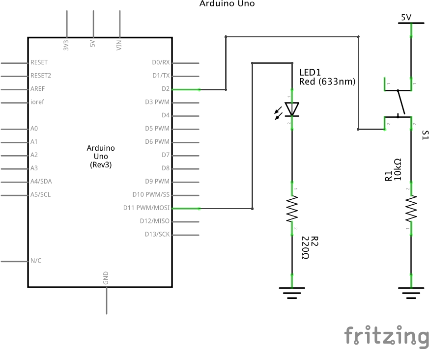

# Puzzle 01

## 마이크로프로세서 vs 마이크로컨트롤러

Raspberry Pi vs Arduino

## 브레드보드
어떻게 결선되어 있는지 설명하기

## 저항읽기

## 풀업 저항과 풀다운 저항

## LED와 저항
LED는 다이오드이다.
PN 접합 이야기해주자.



## LED 켜기 소스코드

`pinmode()`, `digitalWrite()` 설명

```
int buttonpin = 2; int LED = 11;

void setup() {
    pinMode(buttonpin, INPUT);
    pinMode(LED, OUTPUT);
}

void loop() {
    int buttoninput = digitalRead(buttonpin);
    if (buttoninput == 1) {
        digitalWrite(LED, HIGH); 
    } else {
        digitalWrite(LED, LOW); 
    }
}
```

## 온도센서

`analogRead()` 설명  
아래에서 `analogRead()`를 사용한 것이 조금 이상하다.

```
int potPin = 0; //Set analog interface #0 accessed to LM35 

void setup() {
    Serial.begin(9600);//Set baud rate as 9600 
}

void loop() {
    int val;//
    int dat;//define variable
    val = analogRead(0); // read the analog value and assign to val
    dat = (125 * val) >> 8; //temperature calculation formula 
    Serial.print("Tep:");
    Serial.print(dat);//output dat value
    Serial.println("C");//output character string C 
    delay(500);//delay 0.5 s
}
```

## 포텐시오미터(potentiometer)

```
int potpin = 0; //Define analogue interface.#0
int ledpin = 11; //Define digital interface #11.(PWM output)
int val = 0; //temporary storage the Variable value from the sensor 

void setup() {
    pinMode(ledpin, OUTPUT); // Define digital interface #11 as output  
    Serial.begin(9600);//Setup Baud rate as 9600 
}

void loop() {
    val = analogRead(potpin); // Read analogue value from sensor and assign to val
    Serial.println(val);//Show val variable.
    analogWrite(ledpin, val / 4);
    delay(10);//Delay 0.01 sec.
}
```