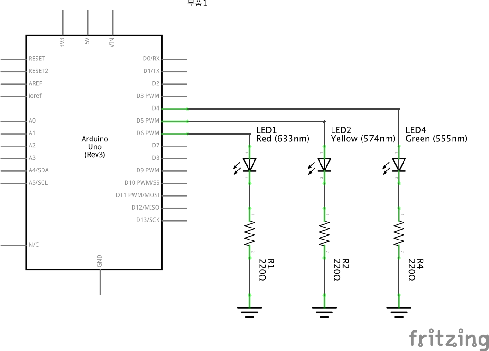

# Puzzle 02 - Traffic Light



## 소스코드

`delay()` 설명

```
int REDpin = 6;
int YELLOWpin = 5; 
int GREENpin = 4; 

void setup() {
    pinMode(REDpin, OUTPUT); 
    pinMode(YELLOWpin, OUTPUT); pinMode(GREENpin, OUTPUT);
}

void loop() {
    digitalWrite(REDpin, HIGH); 
    delay(5000);
    
    digitalWrite(REDpin, LOW); 
    digitalWrite(YELLOWpin, HIGH); 
    delay(1000);
    
    digitalWrite(YELLOWpin, LOW); 
    digitalWrite(GREENpin, HIGH); 
    delay(5000);
    
    digitalWrite(GREENpin, LOW);
}
```
