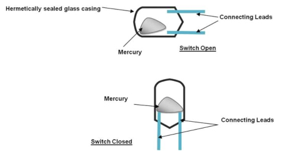
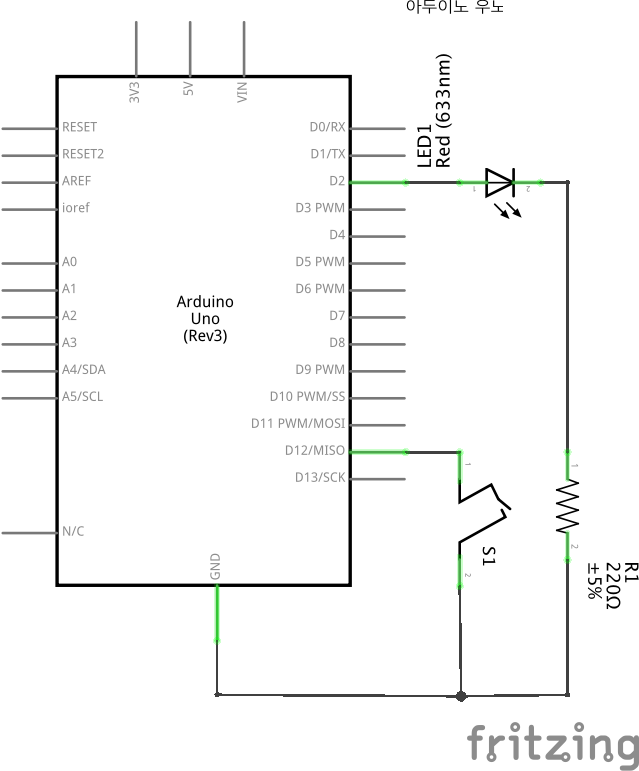

# Puzzle 04 기울기 센서

기울기 센서(*Roll Ball Switch*)는 기울어진 정도에 따라 신호의 통과 여부를 결정하는 소자이다. 원리를 설명하는 그림은 다음과 같다. 소자 내부에 들어있는 수은이 기울기에 따라 이동하면서 Connecting Leads를 쇼트(Short) 시킨다.

쇼트(Short)란?  
[Closed, Open, and Short Circuits for Dummies](http://www.dummies.com/how-to/content/closed-open-and-short-circuits.html)



## 회로도



## 소스코드

```
int LED = 2; 
int tilt = 12; 

void setup()
{
    pinMode(LED, OUTPUT); // set digital 2 for LED output
    pinMode(tilt, INPUT); // set digital 12 for tilt sensing 
}

void loop()
{ 
    if (digitalRead(tilt) == HIGH)
    {
        digitalWrite(LED, HIGH); //light up led
    } 
    else//otherwise 
    {
        digitalWrite(LED, LOW); //turn off led 
    }
}
```