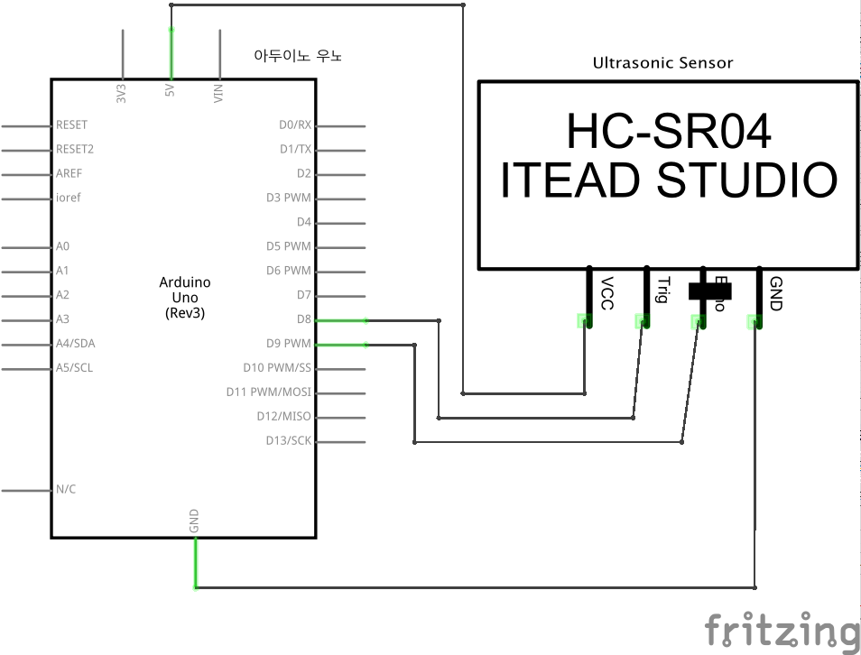

# Puzzle 05 HC-SR04 초음파 센서

상당히 특이하게 생긴 소자를 다룬다. 하지만 생각보다 그리 복잡하지 않으므로 겁먹지 말자. 소자는 네 가지 핀을 가지고 있다: `VCC`, `Trig`, `Echo`, `GND`. `VCC`와 `GND`는 여태껏 해왔던 것처럼 아두이노에 연결하면 되고, `Trig`(Trigger)와 `Echo`를 각각 아두이노의 8번, 9번 디지털 핀에 연결한다. 초음파로 거리를 측정하는 원리는 초음파가 반사되어 돌아오는 시간을 계산하는 것이다. 따라서 `Trig`를 통해서 신호가 나가고(Output) `Echo`에서 신호를 읽어들인다(Input).

## 회로도 


## 소스코드

```
const int TriggerPin = 8; // Trig pin 
const int EchoPin    = 9; // Echo pin
     long Duration   = 0;

void setup() {
    pinMode(TriggerPin, OUTPUT); // Trigger is an output pin
    pinMode(EchoPin   , INPUT ); // Echo is an input pin
    Serial.begin(9600);          // Serial Output
}

void loop() { 
    digitalWrite(TriggerPin, LOW); 
    delayMicroseconds(2); 
    digitalWrite(TriggerPin, HIGH); // Trigger pin to HIGH
    delayMicroseconds(10);          // 10us high
    digitalWrite(TriggerPin, LOW);  // Trigger pin to LOW
 
    Duration = pulseIn(EchoPin, HIGH);     // Waits for the echo pin to get high
    // returns the Duration in microseconds
    long Distance_mm = Distance(Duration); // Use function to calculate the distance

    Serial.print("Distance = "); // Output to serial
    Serial.print(Distance_mm); 
    Serial.println(" mm"); 
    delay(1000);                 // Wait to do next measurement
}

// 신호가 돌아오는데 걸리는 시간으로부터 물체와의 거리를 계산하는 함수
long Distance(long time) {
    // Calculates the Distance in mm
    // ((time) * (Speed of sound)) / toward and backward of object) * 10
    
    long DistanceCalc;                 // Calculation variable
    DistanceCalc = ((time / 2.9) / 2); // Actual calculation in mm
    //DistanceCalc = time / 74 / 2;    // Actual calculation in inches
    return DistanceCalc;               // return calculated value 
}
```

## `pulseIn()` 함수
위 소스코드에서 `pulseIn()` 함수는 두 변수를 매개변수로 전달받는다: `EchoPin`과 `HIGH`. 초음파를 일종의 pulse라고 이해했을 때, `EchoPin`으로 pulse를 입력받고 그 값은 `HIGH`(5V)이 되어야 한다는 의미이다. 이 함수는 `EchoPin`에서 `HIGH` 값을 받기까지 걸리는 시간을 Microsecond 단위로 측정한다.

음속은 대략 340m/s( = 0.34mm/us ~= 2.9us/mm) 이므로 초음파 근접 센서로 측정한 시간(us)에 곱하고 편도거리(mm)를 구하기 위해 왕복거리에서 절반을 나누어 준다.

## 참고
[Instructables - Simple Arduino and HC-SR04 Example](http://www.instructables.com/id/Simple-Arduino-and-HC-SR04-Example/)

[pulseIn 함수 - Arduino Reference](https://www.arduino.cc/en/Reference/PulseIn)

[HC-SR04 초음파 센서](http://blog.0xff.co.kr/21)