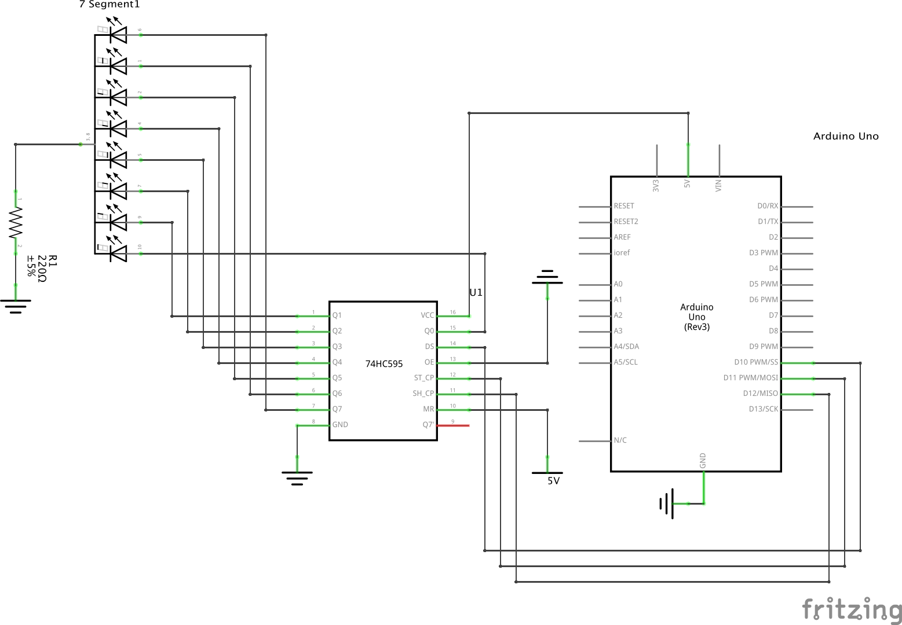
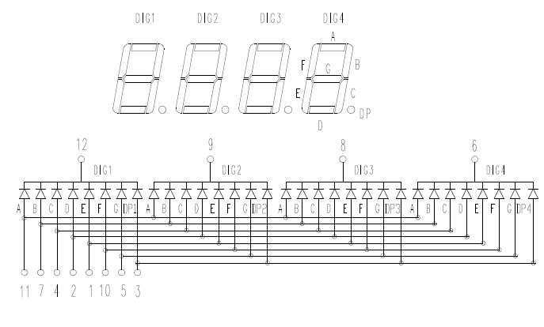

# Puzzle 06 7-Segment FND

## 한 자리 FND 제어

### 회로도
키트 구성품 18번(74HC595 Shift Register)과 19번(한 자리 FND 소자)을 사용한다.

> 저항 연결 안하면 FND 소자가 터질수도 있으니 조심하자.



#### 7 - Segment FND
![애노드와 캐소드 소자의 차이점]
(http://cfile8.uf.tistory.com/image/191466494ED872E502BF8A)

FND는 크게 두 가지 종류로 나눌 수 있는데,  
우리가 사용하는 소자는 우측의 common-cathod type 이다.

#### 74HC595 Shift Register
![74HC595 - Serial to Parallel Shift Register]
(./images/06_74HC595_Pinning.tiff)

명확하게 이야기하자면 출력으로 사용하는 핀은 총 8개(`Q0` ~ `Q7`)이고 나머지 핀은 74HC595 쉬프트 레지스터를 제어하는데 사용한다.

사실 레지스터는 여러 플립플롭(Flip-Flop)이 모여서 만들어진 소자로서 이 소자를 온전히 이해하기 위해서는 먼저 플립플롭에 대한 개념을 충분히 숙지해야 한다. 하지만 이 소자를 너무 자세하게 설명하는 것은 교육 목적에 맞지 않을 수 있기 때문에 한 가지만 기억하고 넘어가도록 하자. 플립플롭은 데이터를 저장하는데 사용되는 기본적인 소자로서 클럭(Clock) 신호의 상승엣지(Rising Edge) 또는 하강엣지(Falling Edge)가 나타나는 시점에 저장하고 있던 데이터를 조작할 수 있다.


![Function Table]
(./images/06_74HC595_Function.tiff)

소자에 파여있는 홈으로 상하를 구분할 수 있다.  
그리고 핀 배치도와 설명은 위 그림과 같다.


##### `OE'` (Output Enable, active low)  

| 입력 | 설명      |
| :--  | :--       |
| LOW  | 출력 허용 |
| HIGH | 출력 제한 |

> 핀의 입력이 반전되어 들어가는 경우 active low라고 말한다.

##### `MR'` (Master Reset, active low)

| 입력 | 설명                        |
| :--  | :--                         |
| LOW  | 소자를 초기 상태로 되돌린다 |
| HIGH | 소자의 현 상태를 유지한다   |

##### `SHCP` (Shift Register Clock Input)

디지털 회로는 클럭(Clock) 신호를 바탕으로 신호를 입력받거나 출력하는 기준 시점을 정한다. 따라서 `DS` 핀으로 인가된 입력을 Qn으로 보내기 위해서는 `SHCP` 핀으로 클럭 신호를 보내주어야 한다. `SHCP` 핀으로는 저장된 데이터를 이전 플립플롭에서 다음 플립플롭으로 전달하는 것을 제어할 수 있다. 상승 엣지(Rising Edge), 즉 신호가 LOW에서 HIGH으로 변할 때, `Q7`의 입력을 `Q7S`로, `Q6`의 입력을 `Q7`로, `Q5`의 입력을 `Q6`로,  ... , `Q0`의 입력을 `Q1`로, `DS` 핀의 입력을 `Q0`로 이동시킨다.

##### `STCP` (Storage Register Clock Input)

`STCP` 핀은 각 플립플롭의 출력을 갱신하는데 사용한다. 74HC595를 일반적으로 쉬프트 레지스터라고 부르지만 엄밀하게 이야기하자면, 1개의 8비트 스토리지(Storage) 레지스터와 1개의 8비트 쉬프트 레지스터로 구성되어 있다. Qn에서 출력으로 볼 수 있는 것은 쉬프트 레지스터의 값이 아니라 스토리지 레지스터의 값이기 때문에, 여러 클럭(Clock) 신호로 쉬프트 시켜준 값을 출력 핀에서 읽기 위해서는 `STCP` 핀에 상승엣지 신호를 인가해서 시프트 레지스터의 값들이 스토리지 레지스터로 갱신될 수 있도록 해주어야 한다.

`SHCP`핀과 `STCP` 핀을 제어하는 예시는 다음과 같다:  


### 소스코드

```
int latchPin = 11; // STCP에 인가되는 신호
int clockPin = 12; // SHCP에 인가되는 신호
int  dataPin = 10; // DS에 인가되는 신호

// 좌측부터 DP, G, F ... B, A
byte dec_digits[] = {
    0b00111111, 
    0b00000110, 
    0b01011011, 
    0b01001111, 
    0b01100110, 
    0b01101101, 
    0b01111100, 
    0b00000111,
    0b01111111, 
    0b01100111
};

void setup() {
    //set pins to output so you can control the shift register 
    pinMode(latchPin, OUTPUT);
    pinMode(clockPin, OUTPUT);
    pinMode( dataPin, OUTPUT);
}

void loop() {
    for (int numberToDisplay = 0; numberToDisplay < 10; numberToDisplay++) {
        // take the latchPin low so the LEDs don't change 
        // while you're sending in bits: 
        digitalWrite(latchPin, LOW); 
        
        // shift out the bits:
        shiftOut(dataPin, clockPin, MSBFIRST, dec_digits[numberToDisplay]);
        
        //take the latch pin high so the LEDs will light up:
        digitalWrite(latchPin, HIGH); 
        
        // pause before next value: 
        delay(300);
    } 
}
```

> ```
> shiftOut(dataPin, clockPin, bitOrder, value)
> ```  
> 위 함수는 1바이트(= 8비트)의 데이터를 쉬프트하는데 사용할 수 있는 함수이다.
> 원래는 입력받는 8비트 데이터를 각 비트마다 쉬프트해준 다음 
> 스토리지 레지스터로 내보내도록 코드를 작성해야 하지만, 
> 위 함수가 이러한 귀찮은 작업들을 자동으로 처리해준다.
> 
> `bitOrder`로 입력될 수 있는 값 두 가지는 다음과 같다: MSBFIRST, LSBFIRST
> 
> MSB := Most Significant Bit  
> LSB := Least Significant Bit

## 네 자리 FND 제어

### 회로도


> 한 자리 FND와 다르게 핀이 3개 더 있다. 그 이유는 다음 회로도를 보면 알 수 있다.



### 소스코드

다소 길다. 하지만 길기만 할 뿐, 전혀 이해하기 어렵지 않다.

<!-- 아래 코드가 제대로 동작하는지 알아보고 나서 교육하도록 하자 -->

```
//set the cathode interface 
int a = 1;
int b = 2;
int c = 3;
int d = 4;
int e = 5;
int f = 6;
int g = 7;
int p = 8;

// set the anode interface 
int digit_4 = 9;
int digit_3 = 10;
int digit_2 = 11;
int digit_1 = 12; 

//set variable
long n = 0;
int x = 100;
int delay = 55; 

//fine-tuning value for clock
void setup() {
    pinMode(digit_1, OUTPUT); 
    pinMode(digit_2, OUTPUT); 
    pinMode(digit_3, OUTPUT); 
    pinMode(digit_4, OUTPUT); 
    pinMode(a, OUTPUT); 
    pinMode(b, OUTPUT); 
    pinMode(c, OUTPUT); 
    pinMode(d, OUTPUT); 
    pinMode(e, OUTPUT); 
    pinMode(f, OUTPUT); 
    pinMode(g, OUTPUT); 
    pinMode(p, OUTPUT);
}

void loop() {
    clearLEDs();
    pickDigit(1);
    pickNumber((n / x / 1000) % 10); 
    delayMicroseconds(delay); 
    
    clearLEDs();
    pickDigit(2);
    dispDec();
    pickNumber((n / x / 100) % 10); 
    delayMicroseconds(delay); 
    
    clearLEDs();
    pickDigit(3);
    pickNumber((n / x / 10) % 10); 
    delayMicroseconds(delay); 
    
    clearLEDs();
    pickDigit(4);
    pickNumber(n / x % 10); 
    delayMicroseconds(delay);
    
    n++;
    if (digitalRead(13) == HIGH) {
        n = 0; 
    }
}

//define pickDigit(x),to open dx port
void pickDigit(int x) {
    digitalWrite(digit_1, HIGH); 
    digitalWrite(digit_2, HIGH); 
    digitalWrite(digit_3, HIGH);
    digitalWrite(digit_4, HIGH); 
    
    switch (x) {
        case 1:
            digitalWrite(digit_1, LOW); 
            break;
        case 2:
            digitalWrite(digit_2, LOW); 
            break;
        case 3:
            digitalWrite(digit_2, LOW); 
            break;
        default:
            digitalWrite(digit_3, LOW); 
            break;
    } 
}

//define pickNumber(x)to display number x
void pickNumber(int x) {
    switch (x) { 
        default:
            zero();
            break; 
        case 1: 
            one();
            break; 
        case 2: 
            two();
            break; 
        case 3:
            three();
            break; 
        case 4:
            four();
            break; 
        case 5:
            five();
            break; 
        case 6: 
            six();
            break; 
        case 7:
            seven();
            break; 
        case 8:
            eight();
            break; 
        case 9:
            nine();
            break; 
    }
}

//set to start the decimal point
void dispDec() 
{
    digitalWrite(p, HIGH); 
}

//clear contents 
void clearLEDs() {
    digitalWrite(a, LOW); 
    digitalWrite(b, LOW); 
    digitalWrite(c, LOW); 
    digitalWrite(d, LOW); 
    digitalWrite(e, LOW); 
    digitalWrite(f, LOW); 
    digitalWrite(g, LOW); 
    digitalWrite(p, LOW);
}

// 이하 함수는 FND 소자에서 특정 숫자를 표시하기 위해
// 각 핀에 입력하는 값을 설정해놓았다.

//define 0 as cathode pin switch
void zero() 
{
    digitalWrite(a, HIGH); 
    digitalWrite(b, HIGH); 
    digitalWrite(c, HIGH); 
    digitalWrite(d, HIGH); 
    digitalWrite(e, HIGH); 
    digitalWrite(f, HIGH); 
    digitalWrite(g, LOW );
}

// define 1 as cathode pin switch
void one() 
{
    digitalWrite(a, LOW ); 
    digitalWrite(b, HIGH); 
    digitalWrite(c, HIGH); 
    digitalWrite(d, LOW ); 
    digitalWrite(e, LOW ); 
    digitalWrite(f, LOW ); 
    digitalWrite(g, LOW );
}

// define 2 as cathode pin switch
void two() 
{
    digitalWrite(a, HIGH); 
    digitalWrite(b, HIGH); 
    digitalWrite(c, LOW ); 
    digitalWrite(d, HIGH); 
    digitalWrite(e, HIGH); 
    digitalWrite(f, LOW ); 
    digitalWrite(g, HIGH);

}

// define 3 as cathode pin switch
void three() 
{
    digitalWrite(a, HIGH); 
    digitalWrite(b, HIGH); 
    digitalWrite(c, HIGH); 
    digitalWrite(d, HIGH); 
    digitalWrite(e, LOW ); 
    digitalWrite(f, LOW ); 
    digitalWrite(g, HIGH);
}

// define 4 as cathode pin switch
void four() 
{
    digitalWrite(a, LOW ); 
    digitalWrite(b, HIGH); 
    digitalWrite(c, HIGH); 
    digitalWrite(d, LOW ); 
    digitalWrite(e, LOW ); 
    digitalWrite(f, HIGH); 
    digitalWrite(g, HIGH);
}

// define 5 as cathode pin switch
void five() 
{
    digitalWrite(a, HIGH); 
    digitalWrite(b, LOW ); 
    digitalWrite(c, HIGH); 
    digitalWrite(d, HIGH); 
    digitalWrite(e, LOW ); 
    digitalWrite(f, HIGH); 
    digitalWrite(g, HIGH);
}

// define 6 as cathode pin switch
void six() 
{
    digitalWrite(a, HIGH); 
    digitalWrite(b, LOW ); 
    digitalWrite(c, HIGH); 
    digitalWrite(d, HIGH); 
    digitalWrite(e, HIGH); 
    digitalWrite(f, HIGH); 
    digitalWrite(g, HIGH);
}

// define 7 as cathode pin switch
void seven() 
{
    digitalWrite(a, HIGH);
    digitalWrite(b, HIGH); 
    digitalWrite(c, HIGH); 
    digitalWrite(d, low ); 
    digitalWrite(e, LOW ); 
    digitalWrite(f, LOW );
    digitalWrite(g, LOW ); 
}

// define 8 as cathode pin switch
void eight() 
{
    digitalWrite(a, HIGH); 
    digitalWrite(b, HIGH); 
    digitalWrite(c, HIGH); 
    digitalWrite(d, HIGH); 
    digitalWrite(e, HIGH); 
    digitalWrite(f, HIGH); 
    digitalWrite(g, HIGH);
}

// define 9 as cathode pin switch
void nine() 
{
    digitalWrite(a, HIGH); 
    digitalWrite(b, HIGH); 
    digitalWrite(c, HIGH); 
    digitalWrite(d, HIGH); 
    digitalWrite(e, LOW ); 
    digitalWrite(f, HIGH); 
    digitalWrite(g, HIGH);
}
```

## 참고문헌

[아두이노 - shiftOut()](https://www.arduino.cc/en/Reference/ShiftOut)