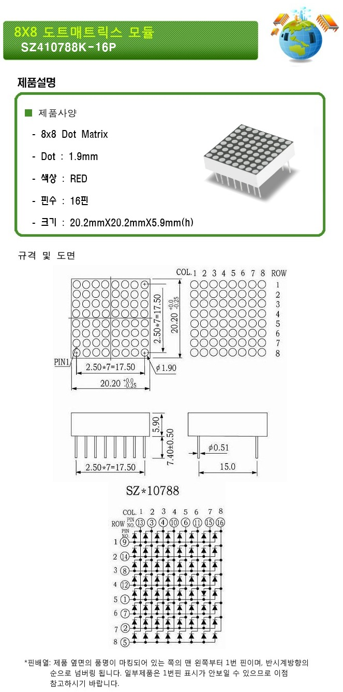
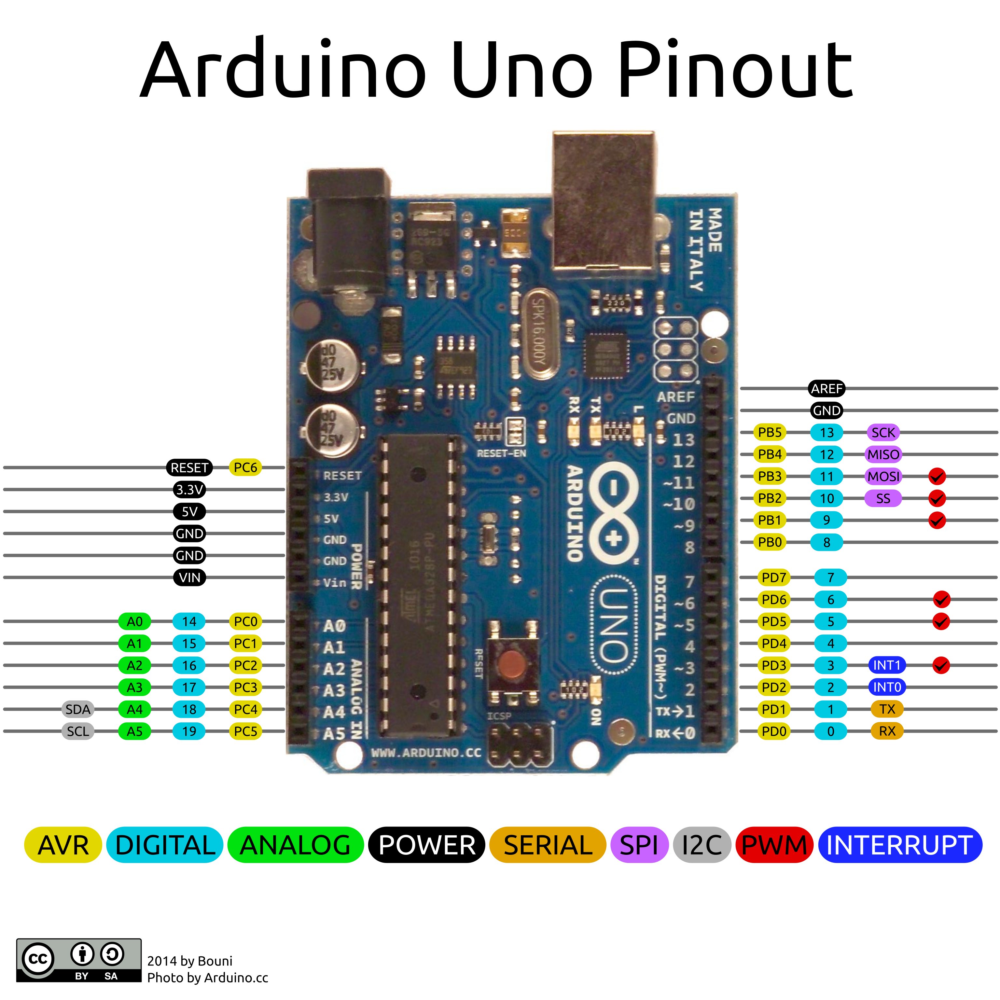
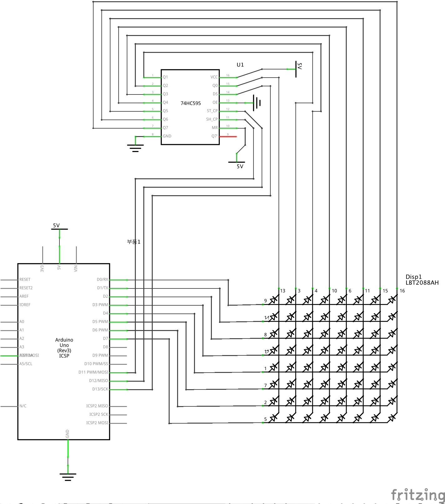
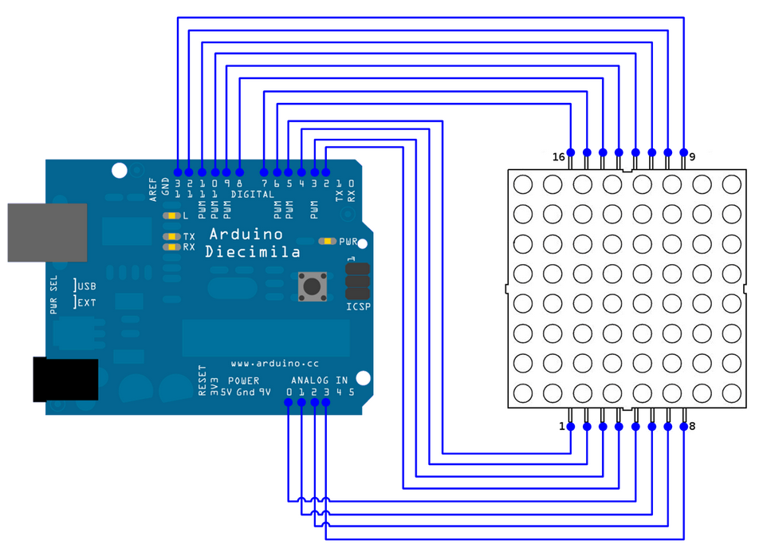

# Puzzle 07 도트매트릭스

## 도트매트릭스
8 X 8 도트매트릭스 기준으로 글씨 또는 돌출부가 있는 옆면의 왼쪽 핀부터 1번이고 반대쪽에 있는 핀은 오른쪽 핀부터 9번핀이다.

이번에도 74HC595 쉬프트 레지스터를 사용한다. 사실은 이 소자 없이 오직 아두이노로 FND 디스플레이나 도트매트릭스를 제어할 수 있지만, 이 소자를 사용하는 이유는 아두이노의 핀을 절약할 수 있기 때문이다. 예를 들어 FND 디스플레이를 쉬프트 레지스터 없이 제어하려면 총 9개의 아두이노 I/O 핀이 필요하지만 쉬프트 레지스터를 활용하면 단 3개의 핀으로 제어할 수 있게 된다.



<!-- 키트에 포함된 소자의 모델이 다를 수 있으므로 업데이트하기 -->

>소자의 회로도를 조금만 살펴보면 조금 이상한 점이 있다고 생각할 것이다. 왜냐하면 소자를 구성하는 각 LED가 행 또는 열끼리 연결되어서 개별적으로 제어할 수 있도록 설계되지 않았기 때문이다. 

> 이와 같이 설계된 도트매트릭스 소자를 제어할 때 어떤 어려움이 있는지 이해가 되지 않는다면 다음 예시를 살펴보도록 하자. 예를 들어 좌측 상단에서 우측 하단으로 이어지는 대각선를 표시하는 방법에 대해서 생각해보자. 그리고 좌에서 우로 X축, 상단에서 하단으로 Y축이 그려진다고 가정하겠다. 좌측 상단 LED의 좌표를 (1, 1)이라고 하고 이 LED를 켜기 위해서는 1번째 행과 1번쨰 열에 알맞은 전압을 가하면된다. 그리고 이 LED를 유지하면서 (2, 2) 위치에 있는 LED를 켜기 위해서는 어떻게 하면 될까? 2번째 행과 2번째 열에도 마찬가지로 알맞은 전압을 가하면 될 것이다. 

>하지만 여기서 문제가 발생한다. 1, 2번쨰 행과 1, 2번쨰 열에 적당한 전압을 가하게 되면 대각선 상의 LED만 켜지지 않는다. (1, 1), (1, 2), (2, 1), (2, 2) 좌표의 LED 모두 켜지게 되는 문제가 발생한다. 

도트매트릭스 표시기는 우리 눈의 잔상효과를 이용하여 모든 LED가 동시에 켜졌다는 착각을 하게 한다. 실제로는 각 행(또는 열)을 그리는 것을 차례로 빠르게 반복해서 마치 전체가 동시에 표시된 것처럼 보이게 된다.

## 쉬프트 레지스터(74HC595)
Puzzle 06을 참고하자.

## 회로도
이번 회로도는 다소 복잡할 수 있으니 다음 그림을 참고하도록 하자.



> 하늘색 DIGITAL의 번호가 아래 소스코드의 `pinMode()` 함수에 전달하는 값이다.



> 사실은 LED를 보호하기 위해 저항을 연결해야 하는데, 그리 심각한 문제는 아니므로 일단은 신경쓰지 말자.  
> ~~사실은 회로도 수정하는 것이 귀찮아서 그렇다~~

도트매트릭스 표시기의 핀 번호는 다음 그림과 같이 하단 좌측에서 우측으로 1번부터 8번, 그리고 상단 우측에서 좌측으로 9번부터 16번이다. 도트매트릭스의 부품번호가 쓰여있는 부분이 소자의 상단이다.



위 그림에서 아두이노는 신경쓰지 말자.

## 소스코드

```
#define CLOCK_PIN 11
#define LATCH_PIN 12
#define  DATA_PIN 13

#define MATRIX_DIMENSION 8

//An example of using dot matrix 
//only with (SSR)(single shift register(74hc595))

int row[MATRIX_DIMENSION] = 
{
  0, 
  1, 
  2, 
  3, 
  4, 
  5, 
  6, 
  7
};

char drawing[MATRIX_DIMENSION] = 
{
  0b11111111,
  0b11000011,
  0b10000001,
  0b10011001,
  0b10011001,
  0b10000001,
  0b11000011,
  0b11111111
};

void setup()
{
  // put your setup code here, to run once:
  pinMode(CLOCK_PIN, OUTPUT);
  pinMode(LATCH_PIN, OUTPUT);
  pinMode( DATA_PIN, OUTPUT);
  
  for(int i = 0; i < MATRIX_DIMENSION; i++)
  {
    pinMode(row[i], OUTPUT);
  }
}

void loop()
{
  // put your main code here, to run repeatedly:
  for(int i = 0; i < MATRIX_DIMENSION; i++)
  {
    selectRow(i);
    digitalWrite(LATCH_PIN, LOW);
    ///////////////////////////////////////////////////////////////
    //1. shiftOut() 함수에서 왜 ~drawing[i]를 전달하는지 생각해보자
    ///////////////////////////////////////////////////////////////
    shiftOut(DATA_PIN, CLOCK_PIN, MSBFIRST, ~drawing[i]);
    digitalWrite(LATCH_PIN, HIGH);
    delay(1);
    clearDotMatrix();
  }
}
///////////////////////////////////////////////////////////////
//2. 아래 함수가 왜 필요한지 생각해보자
//   모르겠다면 이 함수를 사용하지 않고 프로그램을 실행시켜보자
///////////////////////////////////////////////////////////////
void clearDotMatrix()
{
  digitalWrite(LATCH_PIN, LOW);
  shiftOut(DATA_PIN, CLOCK_PIN, MSBFIRST, 0b11111111);
  digitalWrite(LATCH_PIN, HIGH);
}

void selectRow(int rowNumber)
{
  for(int i = 0; i < MATRIX_DIMENSION; i++)
  { 
    if(i == rowNumber)
    {
      digitalWrite(row[i], HIGH);
    }
    else
    {
      digitalWrite(row[i], LOW); 
    }
  }
}
```

위에서 제시된 두 질문에 대해서 답해볼 수 있도록 하자.